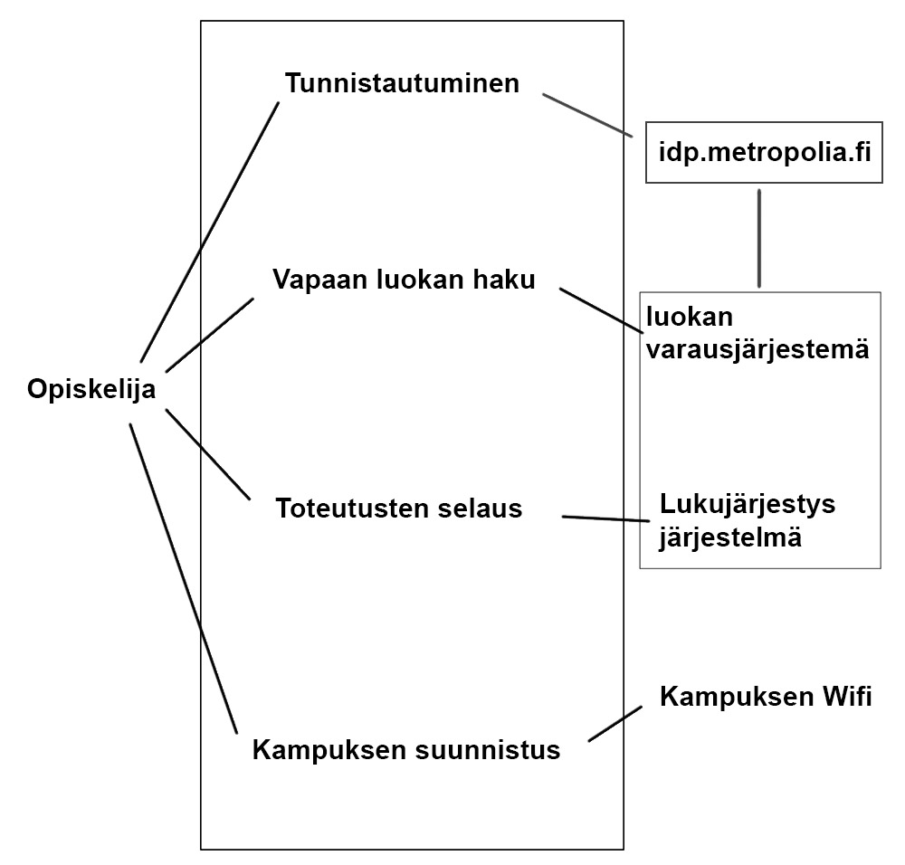

## Käyttötapaukset

* Määritä tänne järjestelmän loppukäyttäjät
* Käyttötapauskaavio, jossa järjestelmän keskeiset käyttötapaukset
* Kuvaile tärkeimmät käyttötapauksista käyttötapausskenaarioina mallipohjaan perustuen
  * mallipohja: määritä alkutila (initial state), normaali kulku (normal flow), lopputila (end state)
  * kerro myös kuinka normaali kulku voi mennä pieleen sekä
  * mahdolliset vaihtoehtoiset kulut (alternate flow)

  
**Loppukäyttäjät**
- Opiskelijat

**Käyttötapauskaavio**

**Käyttötapausskenaario 1**

- Käyttäjä: Opiskelija 
- Tavoite: Missä luokassa opiskelijan seuraava tunti pidetään ja miten sinne pääsee
- Esiehto: Puhelin johon sovellus on asennettu onnistuneesti 
- Käyttötapauksen kulku:
    1. opiskelija avaa sovelluksen puhelimessaan ja laittaa wifin päälle
    2. kirjautuu sisään sovellukseen metropolia tunnuksillaan
    3. sovellus poimii opiskelijan ryhmän mukaan lukujärjestyksen seuraavan tunnin ja näyttää sen kartalla
    4. opiskelija vertaa sovelluksen wifin avulla näyttämää omaa sijaintiaan valittuun päämäärään ja suunnistaa perille
- Poikkeuksellinen toiminta: 
    - Opiskelija asettaa tunnuksensa väärin, sovellusta ei pysty käyttämään
    - Opiskelijalle asetetulla ryhmällä ei ole tuntia lukujärjestyksen mukaan, opiskelijan täytyy käyttää hakuehtoja löytääkseen oikean luokan

**Käyttötapausskenaario 2**
- Käyttäjä: Opiskelija 
- Tavoite: Mistä opiskelija löytää vapaan luokan josta löytyy tarvittavat ohjelmat asennettuna tietokoneisiin
- Esiehto: Puhelin johon sovellus on asennettu onnistuneesti 
- Käyttötapauksen kulku:
    1. opiskelija avaa sovelluksen puhelimessaan ja laittaa wifin päälle
    2. kirjautuu sisään sovellukseen metropolia tunnuksillaan
    3. opiskelija siirtyy hakunäkymään
    4. opiskelija painaa näytä vapaat luokat nappia, näkymään tulee lista vapaista luokista
    5. luokkia valiten opiskelija katsoo missä luokassa on hänen tarvitsemansa asennetut ohjelmat
    6. löytäessään sopivan luokan opiskelija valitsee sen ja ohjelma siirtyy karttanäkymään näyttäen valitun luokan sijainnin
    7. opiskelija vertaa sovelluksen wifin avulla näyttämää omaa sijaintiaan valittuun päämäärään ja suunnistaa perille
- Poikkeuksellinen toiminta: 
    - Opiskelija asettaa tunnuksensa väärin, sovellusta ei pysty käyttämään
    - Vapaita luokkia ei ole, sovellus kertoo asiasta