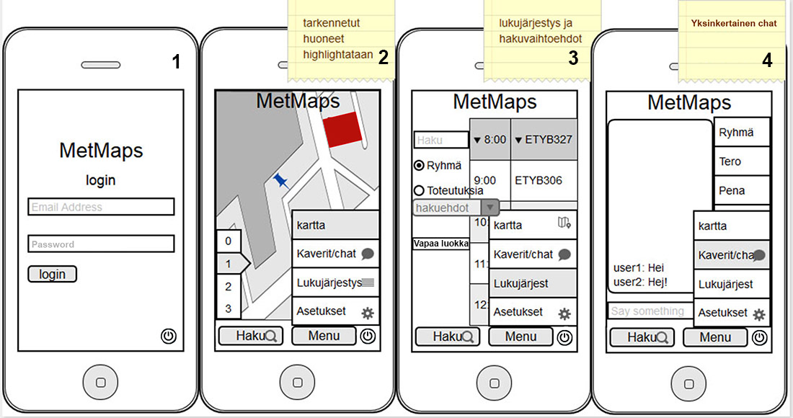

## Käyttöliittymä

Jokaisessa, paitsi sisäänkirjautumisnäkymässä on pääsy alareunasta sovelluksen sulkemiseen sekä menuun, että hakunäkymään. Menu näppäin avaa pop up menun näkymässä, jonka avulla pääsee käsiksi chattiin, lukujärjestykseen ja sovelluksen asetuksiin. 

1. Käyttäjän ensimmäinen näkymä on sisäänkirjautumisnäkymä, jonka kenttiin käyttäjä täyttää metropolia tunnuksensa ja painaa login, jolloin käyttäjä siirtyy sovelluksen karttanäkymään. 

2. Sovelluksen päänäkymän taustana on kampuksen kartta, jossa näkyy käyttäjän oma sijainti luokkien suuruuden tarkkuudella. Kartta näyttää yhden kerroksen kerrallaan ja kerrosta voi vaihtaa kartan reunassa olevilla nappuloilla. Aktiiviset valitut luokat ovat värikoodattuna kartassa. Värikoodiston pitää näyttää missä kerroksessa käyttäjä ja valittu luokka ovat. 

3. Hakunäkymässä on lukujärjestys sekä hakukenttä, jonka alapuolelta voi valita etsiikö ryhmien kalentereita, toteutuksia opettajan nimellä, ryhmätunnuksilla tai molempien avulla. Lukujärjestykset näyttävät vain kyseisen päivän kerrallaan. Vapaita luokkia voi hakea painamalla vapaa luokka näppäintä, jolloin lukujärjestyksen sijaan oikealla puolella näkymää on lista vapaista luokista ja näkyviin saatavana lista ohjelmista, joita luokkien tietokoneihin on asennettuna. Listassa luokkaa painamalla pääsee karttanäkymään jossa luokka on highlightattu. 

4. Keskustelu näkymässä voi keskustella ryhmänsä kanssa sekä muiden sovelluksen käyttäjien kanssa metropolia tunnuksia käyttäen. Keskustelu käydään vasemmalla puolella näkymää ja keskustelut ovat samanaikaisesti auki oikealla olevia tabeja selaten. 

5. Asetusnäkymässä on yksinkertainen lista muutettavista asetuksista. 
